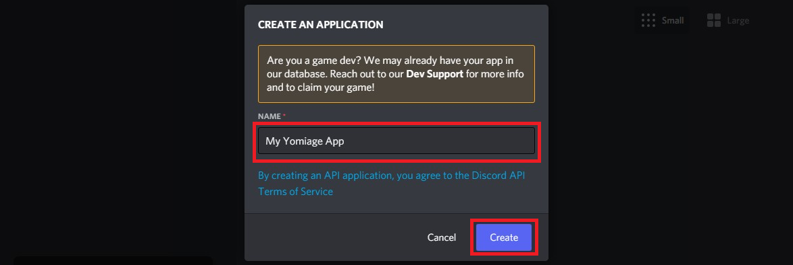

## 導入方法
ここでは、yomiageをあなたのサーバーで使用するまでの手順を説明します。  
yomiageはpython3.10を使用して製造されており、pythonスクリプトを実行することでも起動できますが、
ここではより平易な、バイナリディストリビューションで起動する方法を説明します。

1. [ボットトークンの取得](#ボットトークンの取得)
1. [招待URLの生成](#コマンドの実行)
1. [サーバーへのボット追加](#サーバーへのボット追加)
1. [バイナリディストリビューションのダウンロードと展開](#バイナリディストリビューションのダウンロードと展開)
1. [設定ファイルの編集](#設定ファイルの編集)
1. [ボットの起動](#ボットの起動)
1. [コマンドの実行](#コマンドの実行)

### ボットトークンの取得
まず初めに、[Discord Developer Portal](https://discord.com/developers/applications)でボットユーザーを作成し、ボットトークンを取得します。  
ボットユーザーとは、Discordがあなたのボットを識別するためのユーザーです。ボットユーザーを作成することで、(yomiageのプログラムはみんな同じものを使っていたとしても)yomiageをあなた専用のボットとして動作させることができます。  
この手順は、既に広くWebで解説されている内容であり、特に目新しいものではありません。
作り方が分かっている場合は、この手順に従う必要はありません。

[Discord Developer Portal](https://discord.com/developers/applications)にアクセスし、アプリケーションとボットユーザーを作成します。  
「New Application」をボタンをクリックします。  


「CREATE AN APPLICATION」というポップアップダイアログが出るので、適当な名前をつけて「Create」ボタンをクリックします。  


アプリケーションが作成されると以下の画面に遷移します。左側の「Bot」を選択してください。  


「Add Bot」ボタンをクリックしてボットを追加します。  


確認のポップアップダイアログが出るので、「Yes, do it!」ボタンをクリックします。  


ボットが追加されました。トークンを取得するために、「Reset Token」ボタンをクリックします。  


確認のポップアップダイアログが出るので、「Yes, do it!」ボタンをクリックします。  


トークンが払い出されました。  
画面に表示されているランダムな文字列をコピーして、メモ帳などに保存しておいてください。「Copy」ボタンをクリックすると、トークンがクリップボードにコピーされるので、簡単に張り付けることができます。  
注意!  
この画面から離れると、トークンを取得する手段はなくなります。(再発行になります)  
トークンは、絶対に他人が閲覧できるところにアップロードしないでください。トークンは、あなたのボットが自信を証明するためのパスワードの役割を果たします。
トークンが搾取された場合、第三者があなたのボットになりすまし、サーバーの情報を盗聴・搾取する恐れがあります。


### 招待URLの生成
無事にボットトークンを取得できましたが、まだボットはサーバーに招待されていません。  
招待URLを生成し、各サーバーの管理者にボットを招待してもらいます。

左側の「OAuth2」を選択してください。  


続いて、「URL Generator」を選択します。  


SCOPEの中から「bot」を選択します。  


BOT PERMISSIONSが表示されます。中から、TEXT PERMISSIONSの「Send Messages」および、  
VOICE PERMISSIONSの「Conenct」と「Speak」にチェックをつけます。  


末尾の「GENERATED URL」をコピーし、サーバー管理者にアクセスしてもらいましょう。  
あなたがサーバー管理者であれば、そのままブラウザでURLを開きましょう。  


### サーバーへのボット追加
URLにアクセスすると、以下の画面が表示されます。  
管理権限を持つサーバーに、ボットを参加させることができます。  


URLの生成時に選択した権限が移譲されるを確認されます。「認証」ボタンをクリックします。  


ロボットによるスパム攻撃を防止するためのチェックが行われます。  
指示に従って簡単なクイズに答えてください。  


クイズに成功すると、以下の画面が表示されます。これでボットの追加は完了です。  


### バイナリディストリビューションのダウンロードと展開
前の手順でボットがサーバーに追加されましたが、まだオフライン（灰色）の状態です。  
  
ボットはまだ起動しておらず、Discordに接続されていないためです。以降の手順で、ボットをDiscordに接続しましょう。  

まず、[リリースページ](https://github.com/zosan777/discordbot-yomiage/releases)から、最新バージョンのバイナリディストリビューションをダウンロードします。  
`Assets`の`yomiage-x.x.x.zip`がバイナリディストリビューションです。ダウンロードしたzipファイルを、任意のディレクトリに展開します。

### 設定ファイルの編集
展開したファイルの中に`config.yml`という名称のファイルがあります。このファイルを(メモ帳などの)任意のエディタで開き、以下の記載を探してください。
```
  token: "#### replace with your token! ####"
```

上記の行に、前の手順で取得したボットトークンを設定します。
ダブルコーテーション(")はそのまま残してください。
```
  token: "ASDFGHJKL.DUMMY.TOKEN.LKJHGFDSA"
```

編集が終わったら、ファイルを保存してください。その他の設定もここで一緒に済ませてしまうことができますが、まずは焦らず、ボットが起動することを確認しましょう。

### ボットの起動
展開したファイルの中のyomiage.exeをダブルクリックして起動します。  
以下の通り、「Application successfully launched. Now waiting users operation.」が表示されれば、起動に成功しています。  
コンソール(黒い画面)がすぐに閉じるような場合は、何らかのエラーが発生しています。yomiage.exeと同じディレクトリにyomiage.logが出力されているので、問い合わせの際にヒントになるかもしれません。  
  

さっきまでオフラインだったボットが、オンラインになっているはずです。  
  

### コマンドの実行
ここまで進むと、既にyomiageはコマンドを受け付ける状態になっています。  
試しにヘルプコマンドを実行してみましょう。テキストチャンネルで`.help`と入力します。  
(設定でコマンドプレフィックスを変更している場合は、プレフィックスは`.`でないかもしれません。

  
